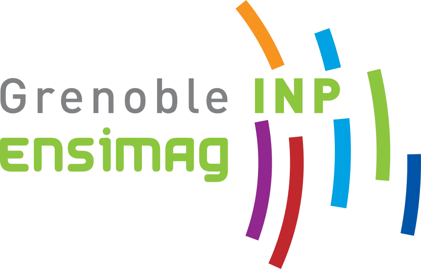

<!-- ===================== HEADER ===================== -->

  

  

  

  

  <strong>🚀 Building intelligent systems with a strong focus on reliability and real-world impact.</strong>

 

<!-- ===================== BUTTONS ===================== -->

 

<!-- ===================== ABOUT ===================== -->

<h2>🧠 About Me</h2>

I'm an engineering student at <strong>ENSIMAG</strong> with a strong interest in
<strong>Artificial Intelligence, Machine Learning, and reliable AI systems</strong>.

My work sits at the intersection of:

  
  
  
  
  
  

I enjoy moving across the entire AI pipeline — from understanding model architectures
and training models to evaluating their robustness and building systems designed for
real-world environments.

 

<!-- ===================== FEATURED PROJECTS ===================== -->

<h2>🚀 Featured Projects</h2>

<table>
<tr>
<td width="50%" valign="top">

<h3>🛩️ Computer Vision for Autonomous eVTOL</h3>

Object detection for autonomous aerial systems operating under
<strong>degraded visibility conditions</strong>.

</td>

<td width="50%" valign="top">

<h3>🔐 Federated UnLearning for IoT</h3>

Privacy-preserving distributed learning with
<strong>machine unlearning</strong> capabilities for IoT environments.

</td>
</tr>

<tr>
<td width="50%" valign="top">

<h3>🛡️ Adversarial Machine Learning</h3>

Studying vulnerabilities of ML models under
<strong>adversarial attacks</strong> and exploring defense strategies.

</td>

<td width="50%" valign="top">

<h3>🤖 Generative AI</h3>

Exploring generative models and LLM-based systems with an emphasis on
<strong>reliability, security and practical applications</strong>.

</td>
</tr>
</table>

 

<!-- ===================== RESEARCH ===================== -->

<h2>🔬 Research Interests</h2>

  
  
  

  
  
  

 

<blockquote>
<strong>How can we build AI systems that are not only intelligent, 
but also reliable, secure and robust in the real world?</strong>
</blockquote>

 

<!-- ===================== TECH STACK ===================== -->

<h2>⚙️ Tech Stack</h2>

<h3>💻 Languages & Core</h3>

  

<h3>🧰 Tools & Systems</h3>

  

<h3>🧠 AI & Data Science</h3>

  
  
  

 

<!-- ===================== CURRENT FOCUS ===================== -->

<h2>🎯 Current Focus</h2>

<table align="center">
<tr>
<td align="center" width="20%">
<h3>🧠</h3>
<strong>Deep Learning</strong>
</td>

<td align="center" width="20%">
<h3>🛡️</h3>
<strong>Robust AI</strong>
</td>

<td align="center" width="20%">
<h3>🌐</h3>
<strong>Federated Learning</strong>
</td>

<td align="center" width="20%">
<h3>✨</h3>
<strong>Generative AI</strong>
</td>

<td align="center" width="20%">
<h3>🔐</h3>
<strong>Secure AI</strong>
</td>
</tr>
</table>

 

<!-- ===================== GITHUB ===================== -->

<h2>📊 GitHub Activity</h2>

  

  

 

  

 

<!-- ===================== CONNECTION ===================== -->

<h2>🤝 Let's Connect</h2>

 

<!-- ===================== FOOTER ===================== -->

  

  <i>“I don't just build AI models — I try to break them too.”</i> 🔥

